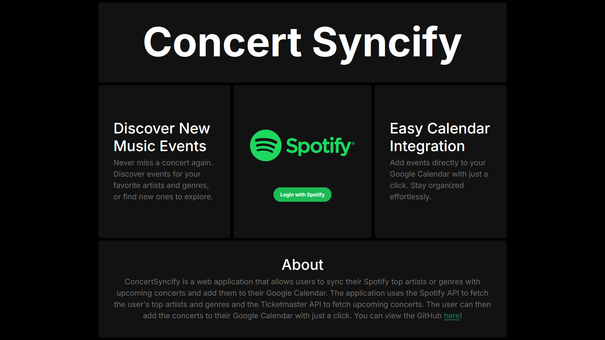
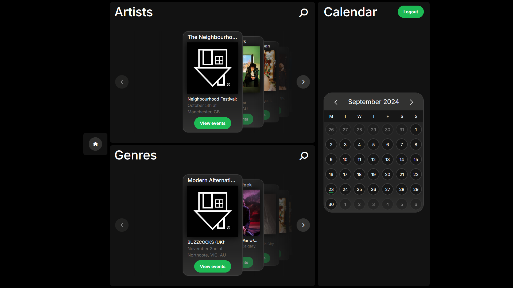
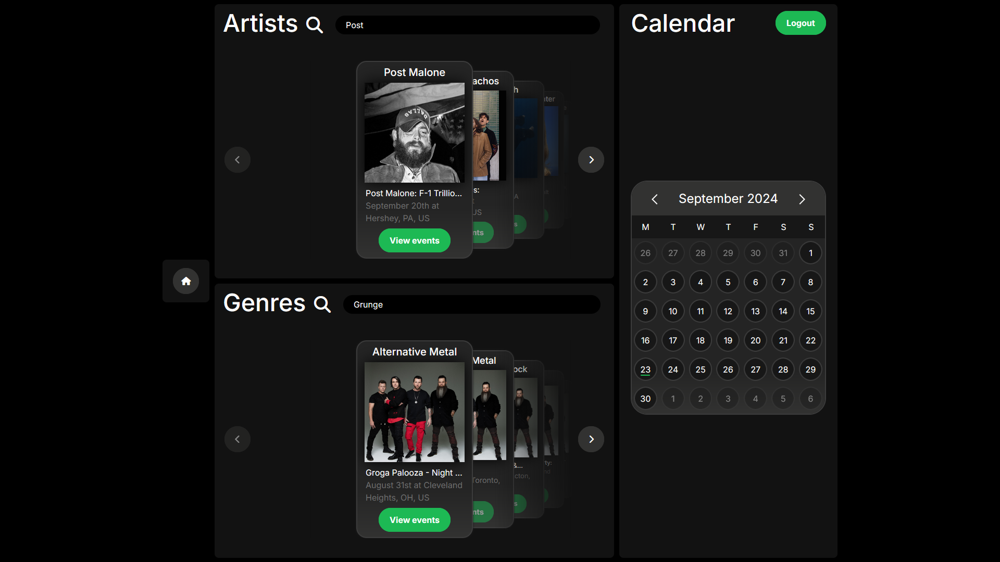
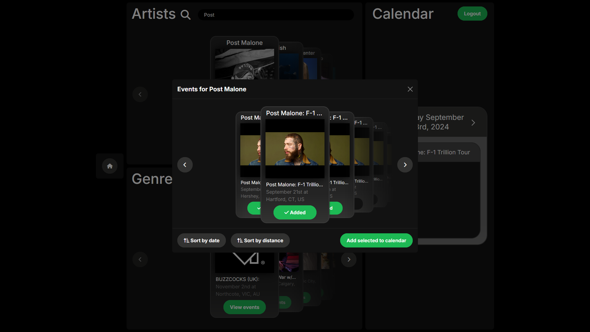
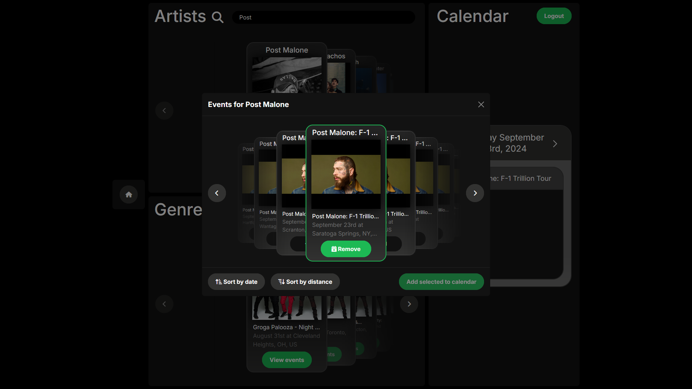

# Concert Syncify

Concert Syncify is a web application that integrates Spotify, Ticketmaster, and Google Calendar to help users track and manage upcoming concerts of their favorite artists. Users can view their top artists and genres, search for artists and genres, and add events to their Google Calendar.

## Table of Contents

1. [Screenshots](#screenshots)
2. [Demo](#demo)
3. [Technologies](#technologies)
4. [Installation](#installation)
5. [Configuration](#configuration)
6. [Usage](#usage)
   - [Authentication](#authentication)
   - [Search](#search)
   - [Event Management](#event-management)
7. [License](#license)

## Screenshots







## Demo

As this app is a project and not in production, I still chose to host it on Render. You can view the live demo [here](https://concertsyncify.onrender.com/), but you will need to send me your Spotify and Google emails to be added to the whitelist, including your full name. You can email me at jackgusler16@yahoo.com. If that's too much, you can follow the installation steps below to run it locally, or click on the image below to view the demo video.

[](https://drive.google.com/file/d/13nZrZMZnmrnUyVYgsS3x6zKtLn4PIJ7r/view?usp=sharing)

## Technologies

- Node.js
- Express
- Vue.js
- Bootstrap
- JWT
- OAuth 2.0
- Axios
- Spotify API
- Ticketmaster API
- Google Calendar API

## Installation

### Prerequisites

- Node.js
- npm
- Spotify Developer Account
- Ticketmaster Developer Account
- Google Developer Account

### Steps

1. Clone the repository:
   ```sh
   git clone https://github.com/jackgusler/ConcertSyncify.git
   ```
2. Install dependencies for the client and start the development server:

   ```sh
   cd client
   npm install
   npm run dev
   ```

   Leave this terminal running.

3. Open a new terminal, navigate to the server directory, install dependencies, and start the server:
   ```sh
   cd server
   npm install
   npm start
   ```

## Configuration

Create a `.env` file in the client directory and add the following environment variables:

```env
VITE_API_ROOT=http://localhost:3000
```

Create a `.env` file in the server directory and add the following environment variables:

```env
CLIENT_URL=your_client_url

SPOTIFY_CLIENT_ID=your_spotify_client_id
SPOTIFY_CLIENT_SECRET=your_spotify_client_secret
SPOTIFY_REDIRECT_URI=http://localhost:3000/api/spotify/callback

TICKETMASTER_CONSUMER_KEY=your_ticketmaster_consumer_key
TICKETMASTER_CONSUMER_SECRET=your_ticketmaster_consumer_secret

GOOGLE_CLIENT_ID=your_google_client_id
GOOGLE_CLIENT_SECRET=your_google_client_secret
GOOGLE_REDIRECT_URI=http://localhost:3000/api/google/callback
```

## Usage

### Authentication

#### Spotify Login

To log in with Spotify, click the "Login with Spotify" button on the homepage. You will be redirected to Spotify's authentication page. After logging in, you will be redirected back to the dashboard.

#### Google Calendar Login

To log in with Google Calendar, click the "Login with Google" button on the dashboard. You will be redirected to Google's authentication page. After logging in, you will be redirected back to the dashboard.

### Search

On the dashboard, use the search bar to find your favorite artists or genres. Click on a result to view the top events.

### Event Management

- **Viewing Events:** Select an artist or genre to view their upcoming events.
- **Adding Events to Google Calendar:** Select events and click "Add to Calendar" to add them to your Google Calendar.
- **Removing Events:** Click the "Remove" button to remove an event from your Google Calendar.

## License

This project is licensed under the MIT License. See the [LICENSE](LICENSE) file for details.
